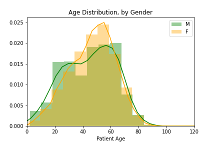
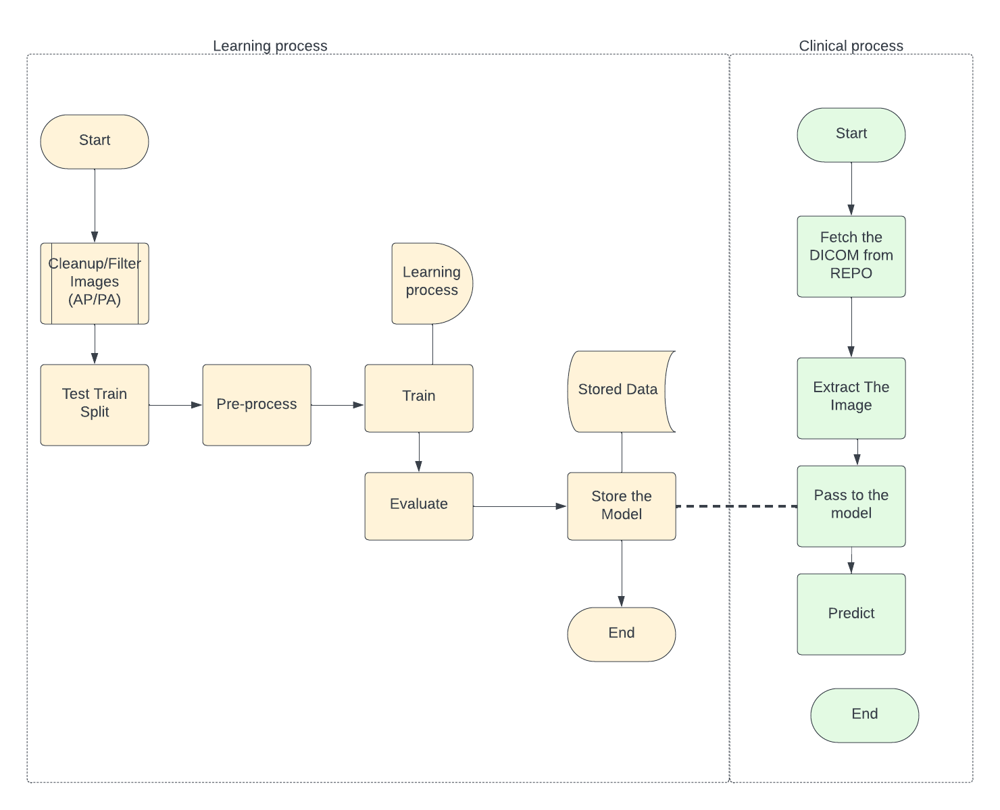
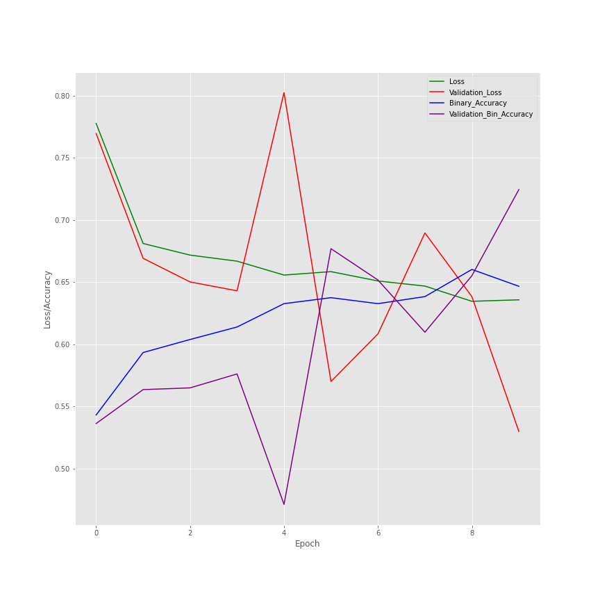
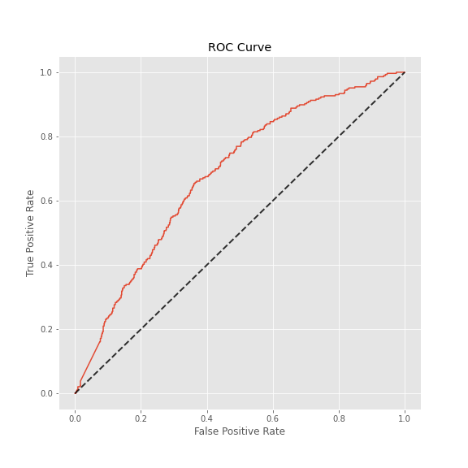

# FDA Preparation

**Your Name:** Suresh Thomas

**Name of your Device:** Pneumonia Prognosticator: - Software as a medical device based on a Machine Learning Model built from chest X-rays, which can predict the presence of pneumonia.*

## Table of contents

<!-- TOC -->
* [FDA Preparation](#fda-preparation)
  * [Table of contents](#table-of-contents)
  * [1. General Information](#1-general-information)
    * [_Summary:_](#summary)
    * [_510(k) Submission:_](#510k-submission)
    * [_Intended Use Statement:_](#intended-use-statement)
    * [_Indications for Use:_](#indications-for-use)
    * [_Device limitations:_](#device-limitations)
  * [2. Technical Documentation:](#2-technical-documentation)
    * [Exploratory data analysis](#exploratory-data-analysis)
    * [_Software algorithm:_](#software-algorithm)
    * [Training and modeling](#training-and-modeling)
    * [Usage flow](#usage-flow-)
    * [Performance evaluation](#performance-evaluation-)
    * [User instructions](#user-instructions-)
  * [3. Clinical Evidence](#3-clinical-evidence)
    * [Literature](#literature-)
    * [Feasibility Study](#feasibility-study)
    * [Pilot Study](#pilot-study-)
  * [4. References](#4-references)
      * [Full Model architecture:](#full-model-architecture)
    * [3. Algorithm Training](#3-algorithm-training)
    * [4. Databases](#4-databases)
    * [5. Ground Truth](#5-ground-truth)
    * [6. FDA Validation Plan](#6-fda-validation-plan)
<!-- TOC -->

## 1. General Information

### _Summary:_

This device is AI deep learning software. This can detect Pneumonia from many X-rays. The software trained on a dataset has X-rays of patients with and without Pneumonia. This uses this training data to identify patterns in the X-Rays, which are indicative of Pneumonia.

### _510(k) Submission:_

This device is submitted under 510(k) as a Class II device. The device is substantially equal to a predicate device, an AI deep-learning software that can detect Pneumonia from many X-rays.

### _Intended Use Statement:_

The intended use of this device is to help healthcare professionals in the diagnosis of Pneumonia. The device is not intended to be used as a stand-alone diagnostic tool. This is to help radiologists to identify the presence of pneumonia in X-Ray images taken with PA or AP viewing position. The device is built using a deep learning algorithm consists of a Convolutional Neural Network (CNN) model created from 100s of 2nd X-Ray images. It's intended to help radiologists in the clinical setting and should be used with a Radiologist's review of the Xray, and other diagnostic notes.

### _Indications for use:_

1. The algorithm needs high-memory and processing power, especially GPU.
2. The model derived from learning from limited training and test data (112,120)
3. Any change in the X-ray radio image capturing process may need re-learning of the model.
4. This is tested for the following specific age &  gender profiles, which may not reflect the population in all cases.

### _Device limitations:_

1. The device (algorithm) needs high memory and processing power, especially GPU.
2. The model is derived from learning from limited training and test data (112,120)
3. Any change in the x-ray radio image capturing process may need re-learning of the model.
4. This has been tested for the following specific age & gender profiles, which may not reflect the actual population in all cases.

## 2. Technical Documentation:

This section describes the analysis of data from the NIH Chest X-ray Dataset and train a CNN to classify a given chest x-ray for the presence or absence of pneumonia. This analysis leads to the development of a CNN model. The technical documentation for this device includes the following:

### Exploratory data analysis (EDA)

The exploratory data analysis on medical imaging data to identify and quality and characteristics of data. This is used to establish  the ground truth for developing training algorithm and labeling the data.
The EDA has been focused on creating FDA documentation, so analysis has been done to reflect the objectives.The  NIH dataset was not specifically get for pneumonia. So, the study narrowed down to chest x-rays only 

A representative subset of data is used for analysis.

The Picture above shows the representative geneder , view position and pixel spacing of images in the sample.

The picture above shows correlation between various params. 

It is observed that 60% of the sample images were captured in PA position and 40% in AP.  This is expected to be same for the bigger population. So Model has been built for AP & PA only.

### _Software algorithm:_

This uses a deep learning algorithm based on a convoluted neural network. The algorithm uses  GPU for fast training of deep learning architecture and access to 112,000 chest X-rays with disease labels from 30,000 patients. The validation of DICOM images is done by checking  DICOM Headers for Modality == 'DX', BodyPartExamined=='CHEST', Position in 'PA' or 'AP.' Once those DICOM images pass through the initial check, the DICOM pixel array(image) is extracted and then normalised & resized to 224 by 224 pixels.

A Sequential Model was built by Fine-tuning the VGG16 Model with ImageNet weights. This model takes the VGG16 model layers up to and including the block5_pool.  Layers taken from the VGG16 model were frozen, so their weights were not trained.  Output from this pre-trained model was flattened. Tee following layers were added:

1.	Dense(1024, activation = 'relu')
2.	Dropout(0.5)
3.	Dense(512, activation = 'relu')
4.	Dropout(0.5))
5.	Dense(256, activation = 'relu')
6.	Dropout(0.5))
7.	Dense(1, activation = 'sigmoid')

### Training and modeling

An extra column to indicate penuemonia was created to avoid processing of "Finding Labels"

The splitting of test/training data is done using sklearn model selection libraries, a built-in library to split the original dataframe into two sets for training and testing the model. The split employs skl.train_test_split method. The training uses a significant amount positive as well as negative pneumonia cases. In the gender class, 1334 males and 946 women used for study.

### Usage flow 

In this field, the input is the DICOM data set. The image is extracted from the DICOM dataset and passes them through the model.

### Performance evaluation 

### User instructions 

## 3. Clinical Evidence

### Literature  study

### Feasibility study

### Pilot study 

## 4. References

https://www.fda.gov/medical-devices/

#### Full model architecture:

| Layer (type) | Output Shape|  Parameter  | Comments 
|--------------|-------------|-------------| 
|input_5 (InputLayer)  |       (None, 224, 224, 3)  |     0        | 
|block1_conv1 (Conv2D)  |      (None, 224, 224, 64)  |    1792      |
|block1_conv2 (Conv2D)    |    (None, 224, 224, 64)  |    36928     |
|block1_pool (MaxPooling2D)   |(None, 112, 112, 64)|      0|         
|block2_conv1 (Conv2D)       | (None, 112, 112, 128)    | 73856     |
|block2_conv2 (Conv2D)        |(None, 112, 112, 128)     |147584    |
|block2_pool (MaxPooling2D)   |(None, 56, 56, 128)     |  0         |
|block3_conv1 (Conv2D)        |(None, 56, 56, 256)|       295168    |
|block3_conv2 (Conv2D)        |(None, 56, 56, 256)|       590080    |
|block3_conv3 (Conv2D)        |(None, 56, 56, 256)|       590080    |
|block3_pool (MaxPooling2D)   |(None, 28, 28, 256)|       0         |
|block4_conv1 (Conv2D)        |(None, 28, 28, 512)|       1180160   |
|block4_conv2 (Conv2D)        |(None, 28, 28, 512)|       2359808   |
|block4_conv3 (Conv2D)        |(None, 28, 28, 512)|       2359808   |
|block4_pool (MaxPooling2D)   |(None, 14, 14, 512)|       0         |
|block5_conv1 (Conv2D)        |(None, 14, 14, 512)|       2359808   |
|block5_conv2 (Conv2D)        |(None, 14, 14, 512)|       2359808   |
|block5_conv3 (Conv2D)        |(None, 14, 14, 512)|       2359808   |
|block5_pool (MaxPooling2D)   |(None, 7, 7, 512)  |       0      |
|flatten_4 (Flatten)          |(None, 25088)      |       0       |  
|dense_15 (Dense)             |(None, 1024)       |       25691136 | 
||dropout_12 (Dropout)        | (None, 1024)      |        0        | 
|dense_16 (Dense)             |(None, 512)        |       524800    |
|dropout_13 (Dropout)         |(None, 512)        |       0         |
|dense_17 (Dense)             |(None, 256)        |       131328    |
|dropout_14 (Dropout)         |(None, 256)        |       0         |
|dense_18 (Dense)             |(None, 1)          |       257  |

### 3. Algorithm Training

**Parameters:** 

Keras.preprocessing.image ImageDataGenerator was used with the following parameters to augment training images.    my_train_idg = ImageDataGenerator(rescale = 1./255,
                                  horizontal_flip = True,
                                  height_shift_range = 0.1,
                                  width_shift_range = 0.1,
                                  rotation_range = 15,
                                  shear_range = 0.1,
                                  zoom_range = 0.1, 
                                  samplewise_center = True,
                                  samplewise_std_normalization = True
                                  )

The Image Data Generator was applied to the training data.  The training data was resized to 224x224 and divided into batch size of 16.  

train_gen = my_train_idg.flow_from_dataframe(dataframe=train_df, 
                                          directory=None, 
                                          x_col = 'path',
                                          y_col = 'pneumonia_class',
                                          class_mode = 'binary',
                                          target_size = (224,224), 
                                          batch_size = 16
                                          )

The optimizer Adam was applied to the training dataset with a learning rate of 0.001 for two models and 0.0001 for a third model.  Binary Cross Entropy was the loss parameter.

optimizer = Adam(learning_rate = 1e-3)
loss = 'binary_crossentropy'
metrics = ['binary_accuracy']
    

Model 3 Training Performance Visualizations  
  
**Figure 1.** Model Training History  

  
**Figure 2.** ROC Curve for threshold selection by maximizing distance away from chance prediction  

  
**Figure 3.** F1-Scores vs Thresholds for threshold selection by maximizing F1-Score  

  
**Figure 4.** Precision-Recall Curve for threshold selection by maximizing Recall  

Confusion Matrix:
Optimize by ROC determined Threshold:

|ROC Thresh|Positive|Negative|
|--------|---------|---------|
|Positive|219|701|
|Negative|67 |443| 

Optimize by F1 determined Threshold:

|F1 Thresh|Positive|Negative|
|--------|---------|---------|
|Positive|218|692|
|Negative|68 |452| 

Maximize Recall by Selecting Threshold with 0.80 Recall, Threshold of 0.355:

|ROC Thresh|Positive|Negative|
|--------|---------|---------|
|Positive|124|351|
|Negative|162 |793| 

**Final Threshold and Explanation:**
 The performance of three thresholds was explored by optimizing by ROC, by F1, and by maximizing Recall.
 1.	When optimizing using a threshold determined by optimizing ROC (0.24046), its confusion matrix shows it yields 219 TP, 67 FN, 701 FP.
 2.  When optimizing using a threshold determined by optimizing F1 (0.24509), its confusion matrix shows it yields 218 TP and 68 FN, 692 FP. The performance is similar to optimizing by ROC. With this threshold, the F1 score is 0.36.
 3.	Based on a Recall of 0.80, the threshold value of 0.355 was chosen.  It's corresponding confusion matrix, it yields 124 TP, 162 FN, with 351 FP.
 For this project, the first model is the best architecture and its optimal threshold value is 0.24509 as determined from F1. This combination yields a F1 score of 0.36.

### 4. Databases
 
Based on EDA work, the Data_Entr_2017.cvs contains 1,431 Images positive for Pneumonia and 110,689 Images negative for Pneumonia.

The data set was split into 80% Training data and 20% for validation data.

  
**Figure 5.** Age Distribution of patients with pneumonia in the complete dataset

**Description of Training Dataset:** 
 For the training data set, the positive to negative images must be equal in number.  
Training DataSet: Pneumonia Positive (80% of all Pneumonia Positive cases in dataset) = 1145 counts, Pneumonia Negative = 1145 counts
 Demographics such as age and gender reflect the general data set.  
 The general dataset showed that the age distribution of Males are statistically different from the age distribution of Females.
 A Two-sample T-Test showed that the age distribution of Males in the Training DataSet match the age distrubition of Males in the General Dataset.
 Another Two-sample T-Test showed that the age distribution of Females in the Training DataSet match the age distrubition of Females in the General Dataset.

**Description of Validation Dataset:** 
 For the validation data set, the demographics must reflect the general data set. Furthermore, in the clinical setting where this algorithm will be deployed, patients are being X-Rayed based on their clinical symptoms that make Pneumonia highly likely.  The prevalence of Pneumonia is about 20% of those who are X-Rayed.  
 Validation DataSet: Pneumonia Positive (20% of all Pneumonia Positive cases in dataset, no overlap with Training Dataset) =286 counts, Pneumonia Negative = 4*286=1,144 counts
 A Two-sample T-Test showed that the age distribution of Males in the Training DataSet match the age distribution of Males in the General Dataset. 
Another Two-sample T-Test showed that the age distribution of Females in the Training DataSet matches the age distribution of Females in the General Dataset. 

### 5. Ground Truth

The dataset used in this project was curated by the NIH.  It is comprised of 112,120 X-Ray images with disease labels from 30,805 unique patients.  The disease labels for each image were created using Natural Language Processing (NLP) to process associated radiological reports.  The estimated accuracy of the NLP labeling accuracy is estimated to be >90%.  
This limitation on the NLP accuracy cannot be rectified, because the original radiology reports are not publically available to review and confirm labels. If these reports are available for human review, then the labels' accuracy will be reasonably higher.

### 6. FDA Validation Plan

**Patient Population Description for FDA Validation Dataset:**
 The patient population should consist of Males and Females in a ratio of approximately 1:1, of ages 95 and younger, and are being screened for Pneumonia.  The expected rate of Positive Pneumonia cases is approximately 20% of those being screened.   Imaging modality must be X-Rays (Code DX) of frontal positions (PA or AP) on Patient Chests.

**Ground Truth Acquisition Methodology:**
 The purpose of this device is to assist Radiologist with their workflow.
The optimal ground truth for this purpose would be the Radiologist's review of the X-Ray with medical history available to them, including lab reports.
To bypass inaccuracies introduced by NLP, a digital form should be provided to Radiologists to mark diseases that they see with each X-Ray review.  The checklist would included common lung diseases such as the 14 diseases in this dataset.

**Algorithm Performance Standard:**
 Based on the provided paper by P.Rajpurkarpar, et al., the performance standard is F1 scores comparing radiologists and algorithms.  F1 scores are the harmonic average of the precision and recall of the models.
 Rajpurkarpar's CheXNet algorithm achieve an F1 score of 0.435, while Radiologists averaged an F1 score of 0.387.  These would be the benchmarks to compare newly developed algorihms to. 
